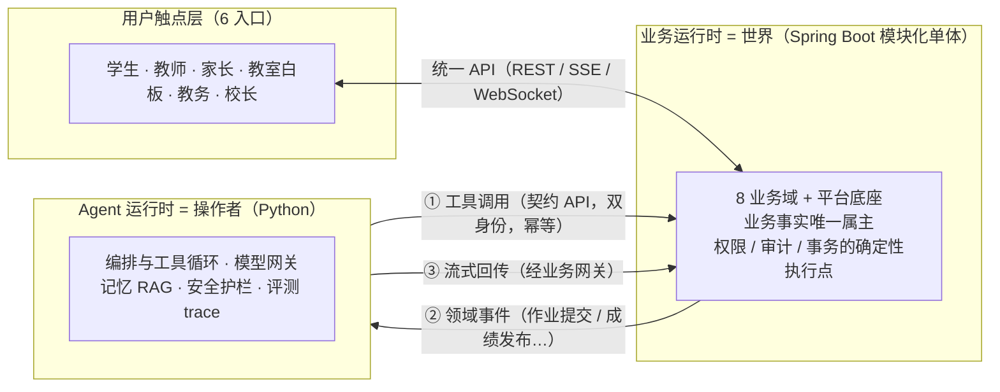

# slate · K12 数字化学校 × Agent 运行环境

> **先建一所稳定运行的数字化学校，再让 Agent 住进来。**

## 这是什么项目

**slate** 是面向 K12 学校的生产级智慧教育平台，也是一个大模型的运行与操作环境：

- **完整的数字学校**：覆盖教、学、练、测、评、管、营全链路——8 个业务域（招生 / 课程 / 学习 / 测评 / 学情档案 / 教务 / 家校 / 收费）+ 平台底座，六端触达（学生 / 教师 / 家长 / 教室白板 / 教务 / 校长）
- **为 Agent 而建**：系统愿景是让教学过程数字化、可观测、可操作，成为 Agent 可以安全运行的教育世界——教师把备课、组题组卷交给 Agent，把精力还给课堂；学生在同一教学主线之下获得因材施教的资料与练习；**讲什么、练什么、考什么，主线始终由任课教师全权把控**（AI 只生成与建议，不做终审）
- **成员设计、Agent 交付**：团队每位成员负责各自系统 / 模块的设计任务，实现由各自指导的 Code Agent 完成——模块切分为边界清晰、可独立验收的任务包，本仓库的整套治理体系为此设计

## 双运行时架构

分工一句话：**业务单体是世界，Agent 运行时是操作者**——后者观测和操作前者，但不拥有前者的数据（无业务库，一切读写经契约 API）。边界契约见 [`docs/architecture/contracts/agent-boundary.md`](docs/architecture/contracts/agent-boundary.md)。

**建设次序（铁律级）**：当前阶段只建数字化学校本体，验收标准是 **Agent-ready**（领域事件外发、契约 API 完备、写操作幂等、审计齐备）；系统投入生产稳定运行一段时间后，方启动 Agent 运行时开发——顺序不可倒置。

## 路线图（学生上课主线）

下表是**学生能上课的主线**分期，不等于全项目范围：招生、教务本体（课表 / 考务 / 学籍）、家校协同、收费运营未排期或按定位选配，Agent 建设期依建设次序后置——完整规划见[蓝图总纲](docs/product/K12教育系统.md) §十四与[分域蓝图](docs/product/blueprint/)。

| 期 | 目标 | 范围 |
|---|---|---|
| 一期 | **能上课** | 平台底座 + 用户权限 + 课程 + 开班 + 学习中心 + 作业闭环 |
| 二期 | **能考试** | 题库、组卷、三形态测评、判分、成绩排名 |
| 三期 | **有洞察** | 学情分析、学生画像、预警、全校数据总览 |
| 四期 | **按定位选配** | 教室端（白板）、直播、售卖、移动端 |

## 技术基线

- **业务运行时**：Spring Boot 3 + JDK 17，按域分模块的模块化单体（Maven 多 module，预留微服务演进）；MyBatis-Plus、Spring Security + JWT、MySQL 8、Redis
- **前端**：Vue 3 + TypeScript + Pinia + Element Plus（学生端 / 管理端 / 教室大屏端）
- **Agent 运行时**：Python 3.12+、FastAPI（编排框架与向量存储待选型，建设期后置）

## 仓库导览

| 你想了解 | 去哪 |
|---|---|
| 产品主线（宪法，长期不变） | [`docs/product/core.md`](docs/product/core.md) |
| 产品全景规划 | [`docs/product/K12教育系统.md`](docs/product/K12教育系统.md)（总纲）→ [`docs/product/blueprint/`](docs/product/blueprint/)（一域一文件） |
| 架构红线与契约 | [`docs/architecture/iron-laws.md`](docs/architecture/iron-laws.md) + [`docs/architecture/contracts/`](docs/architecture/contracts/) |
| 开发流程与设计规程 | [`docs/guides/git-workflow.md`](docs/guides/git-workflow.md)、[`docs/guides/design-guide.md`](docs/guides/design-guide.md) |
| Agent 的工作入口 | [`AGENTS.md`](AGENTS.md) → [`docs/codemap.md`](docs/codemap.md) |

**治理特色**：宪法 / 铁律 / 契约三层文档治理，修宪有流程；契约先行——全局数据模型与 API 约定先冻结再分包实现；两阶段 Issue（设计 → 实现）与 PR 方向评审；ArchUnit 在 CI 防模块腐蚀；文档查找 ≤ 3 跳（契约路由表 → 路径推导 → 索引），Agent 无需全量加载。

## 当前状态

**2026-09 · 文档与架构阶段，尚无代码。**宪法（core v0.5）、契约四件套（API 约定 / 数据所有权 / 主链骨架 / Agent 边界）、蓝图总纲 + 10 份分域蓝图已全部成文；底座任务包的启动 Issue 已备好，等待创建。
