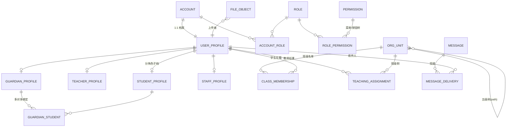

# 平台底座 数据模型（detail/data.md）

status: active
所属域: 平台底座　维护者: 协调者侧　父文档: [../design.md](../design.md)

> 实体级清单的属主权威在 [data-ownership](../../../architecture/contracts/data-ownership.md)；本文档定义底座所辖实体的列级设计。
> 所有表主键 `id BIGINT`（雪花 ID，design §3.1 决策 1）；通用列：`created_at` / `updated_at` / `created_by` / `updated_by` / `deleted`（逻辑删除标记，日志类表除外——只追加）。

## 1. 实体总览（MySQL，库 slate）

| 表 | 内容 | 敏感处理 |
|---|---|---|
| account | 登录账号（含凭证） | 密码 BCrypt；手机号/身份证加密列 |
| user_profile | 用户主档（一人一档，账号与档案 1:1） | 姓名/身份证加密列，展示脱敏 |
| student_profile | 学生档（届、学籍号、监护人摘要） | 学籍号加密列 |
| teacher_profile | 教师档（学科、职称、职工号） | — |
| guardian_profile | 家长档（与学生绑定后激活） | 手机号加密列 |
| staff_profile | 教务/管理员档（岗位） | — |
| org_unit | 组织树（机构/校区/学部/年级/班级五级） | — |
| class_membership | 班级学生名单（入班/出班时间，异动留痕） | — |
| teaching_assignment | 任课关系（教师×班级×课程×学年学期） | — |
| guardian_student | 家长-学生绑定（多对多，关系+主监护人+确认状态） | — |
| role / permission / role_permission / account_role | RBAC（权限=菜单/按钮级，树形） | — |
| message / message_delivery / announcement | 站内信、投递记录、公告 | — |
| notify_channel_config | 外部通知渠道配置（邮件/短信/微信预留） | 凭证加密列 |
| file_object | 文件元数据（对象键、大小、类型、属主、引用状态） | — |
| dict_type / dict_item | 数据字典 | — |
| sys_config | 参数配置（键值+作用域） | — |
| login_log / operation_log | 登录与操作审计（只追加） | — |
| domain_event | 领域事件 outbox（状态：待发/已发/死信） | — |

## 2. ER（关键关系）

## 3. 关键表列级说明（仅列契约级约束，实现可加列）

- **account**：username 唯一；password_hash；status（active/locked/disabled）；user_id；last_login_at
- **org_unit**：type（campus/section/grade/class 五级枚举）；parent_id；path（物化路径 `/{id}/{id}/…`，树查询走 path 前缀）；学年学期字段只存在于 grade 以下的动态编班关系，不在树上
- **class_membership**：class_id + student_id + 学年学期；status（在籍/转出/毕业）；同一学生同学年同学级唯一在籍
- **teaching_assignment**：teacher_id + class_id + course_id（引用课程域 ID，不复制字段）+ 学年学期 + 科目
- **guardian_student**：guardian_id + student_id；relation（父/母/其他监护人）；is_primary；status（pending/confirmed/unbound）——**confirmed 才允许家校域触达**（合规：监护人同意）
- **permission**：code 唯一（如 `course:lesson:publish` 按钮级）；type（menu/button/api）；parent_id（树）
- **file_object**：bucket + object_key 唯一；biz_type + biz_id（业务引用，引用中禁删）；visibility（private/public_signed）
- **operation_log**：account_id；on_behalf_of（双身份的末端用户，可空）；service_id（服务调用方可空）；action；target；params_digest（参数摘要，敏感值脱敏后入摘要）；result（ok/fail）；trace_id；ip；created_at（只追加，不提供修改/删除 API）
- **domain_event**：event_type；aggregate_type + aggregate_id；payload（JSON）；status（pending/sent/dead）；retry_count；next_retry_at；sent_at

## 4. Redis 键设计（底座所辖）

| 键模式 | 用途 | TTL |
|---|---|---|
| `idem:{service}:{key}` | 幂等首次结果（design §3.1 决策 3） | 24h |
| `refresh:{accountId}:{jti}` | refresh token 白名单（登出即删=撤销） | 7d |
| `login:fail:{username}` | 连续失败锁定计数（≥5 锁 15 分钟） | 15min |
| `perm:{accountId}` | 角色+权限集缓存（角色变更时主动失效） | 30min |
| `dict:{type}` | 字典缓存（变更时失效） | 1h |

> 会话不落 Redis（JWT 无状态），refresh 白名单是唯一服务端登录态；多端登录策略一期不做限制。
