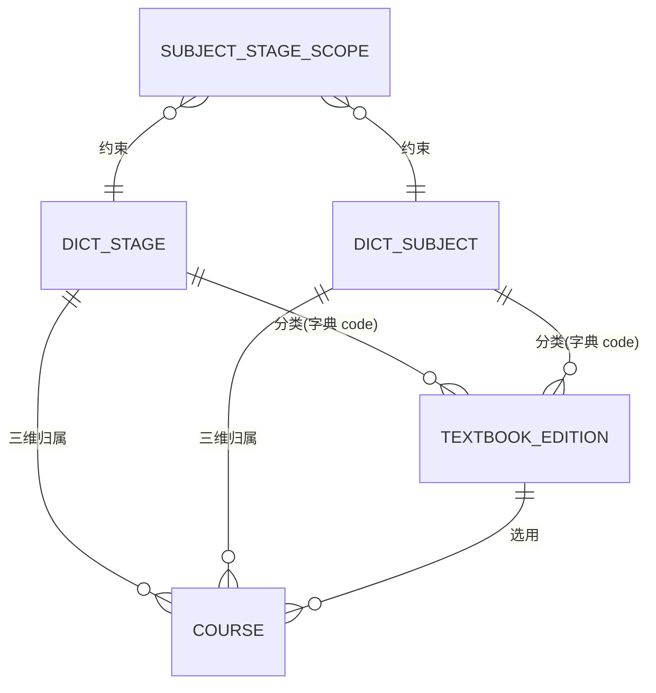

# 课程组织 数据模型（detail/data.md）

status: draft
所属域: 课程　维护者: agent-codex　父文档: [../design.md](../design.md)

> 本文件锁课程组织的实体、字段与约束。章 / 节 / 课时、知识点树、课件资源包的实体归各自任务包，不在本文件。
> ID 契约（雪花、属主生成、他域只引用）见 [global-data-model §2](../../../architecture/contracts/global-data-model.md)。

## 1. 实体总览

| 实体 | 表名 | 属主 | 是否跨域消费 | data-ownership |
|---|---|---|---|---|
| 学段 | *（底座字典，非本域表）* | 平台底座 | 是 | 已登记（字典与参数配置） |
| 学科 | *（底座字典，非本域表）* | 平台底座 | 是 | 已登记（字典与参数配置） |
| 教材版本 | `textbook_edition` | 课程 | 是（二期题库标注） | **待登记**，见 §8 |
| 学科-学段适用关系 | `subject_stage_scope` | 课程 | 否（域内私有） | 无需登记 |
| 课程档案 | `course` | 课程 | 是（任课/教学班/学习记录） | 已登记（「课程/章/节/课时…」行） |

## 2. 三维实体

### 2.1 学段与学科（外部字典，本域只引用）

- 承载：底座字典，类型 `course_stage`（小学 / 初中 / 高中）、`course_subject`（语文 / 数学 / 英语 / 物理 / …）
- 本域**不拥有**这两张字典：不建表、不写缓存表、不复制展示名。读取走 `GET /sys/dicts/{type}`（[系统管理契约](../../平台底座/detail/api/系统管理.md)）
- 存储形态：本域各实体只存**字典项 code**（`stage_code` / `subject_code`），展示名由前端按字典映射，避免同一学科出现两份名字（SSOT）

> 注：`course_stage` / `course_subject` 两个字典类型按 [系统管理契约](../../平台底座/detail/api/系统管理.md) §2「随各域实现任务包登记新类型」在实现期随本模块登记，本设计只声明所需的 code 语义，不预列全量项。

### 2.2 教材版本 `textbook_edition`

一门教材版本 = **某学段 × 某学科** 下的一套教材（出版社 + 版本名 + 修订年）。如：高中 / 数学 / 人民教育出版社 / 人教版 / 2019。

| 字段 | 类型 | 约束 | 说明 |
|---|---|---|---|
| `id` | BIGINT | PK，雪花 | 属主生成，他域只引用 |
| `stage_code` | VARCHAR(32) | NOT NULL | 学段字典 code |
| `subject_code` | VARCHAR(32) | NOT NULL | 学科字典 code |
| `press` | VARCHAR(64) | NOT NULL | 出版社，如「人民教育出版社」 |
| `edition_name` | VARCHAR(64) | NOT NULL | 版本名，如「人教版」「北师大版」 |
| `revision_year` | SMALLINT | NOT NULL DEFAULT 0 | 修订年份；`0` = 未标注（**不用 NULL**，见 §7 唯一索引说明） |
| `status` | VARCHAR(16) | NOT NULL | `ENABLED` / `DISABLED` |
| `remark` | VARCHAR(255) | NULL | 备注 |
| `created_by` / `created_at` / `updated_by` / `updated_at` | BIGINT / DATETIME | NOT NULL | 审计字段（与 `@Audited` 记录互补，表内存最终值） |

**字段可变性**：`stage_code` / `subject_code` / `press` / `edition_name` / `revision_year` 是身份字段，**创建后不可变更**（只可改 `status`、`remark`）。理由：`course` 存的教材版本是引用 ID，若身份字段可改，既有课程的「三维归属」会静默漂移，`CRS-005` 的一致性校验也随之失去意义。需要另一版本 = 新建。

### 2.3 学科-学段适用关系 `subject_stage_scope`

| 字段 | 类型 | 约束 | 说明 |
|---|---|---|---|
| `id` | BIGINT | PK，雪花 | |
| `stage_code` | VARCHAR(32) | NOT NULL | 学段字典 code |
| `subject_code` | VARCHAR(32) | NOT NULL | 学科字典 code |
| `enabled` | TINYINT(1) | NOT NULL DEFAULT 1 | 该组合当前是否可开课 |
| `created_by` / `created_at` / `updated_by` / `updated_at` | BIGINT / DATETIME | NOT NULL | 审计字段 |

- 语义：一条记录 = 「某学科在某学段开设」
- 维护者：教务（`course:scope:write`）；初始数据由实现任务包以种子导入（小学 / 初中 / 高中 × 各自学科）
- 属**域内私有数据**（只用于本域校验，不被任何他域读取），按 [data-ownership](../../../architecture/contracts/data-ownership.md) §规则 无需登记

## 3. 组合关系与合法性

```
学段 ─┐
      ├─▶ 学科-学段适用关系（能否开课） ─▶ 建课校验
学科 ─┘
学段 ─┐
      ├─▶ 教材版本（用哪套教材） ────────▶ 建课校验
学科 ─┘
课程 = 学段 × 学科 × 教材版本
```

**判定：存在组合约束**（不采用「无约束、只记录」）。理由：小学不开物理、高中不开「品德与生活」，这是 K12 的客观事实；若不约束，题库标注会产出「小学 × 物理」这类无法被学情分析消费的脏数据，而三维对齐正是本模块存在的意义。

建课与改三维时按序校验，任一失败即拒绝：

| 序 | 校验 | 失败错误码 |
|---|---|---|
| 1 | `stage_code`、`subject_code` 是有效字典项（字典存在且含该 code） | `CRS-003` |
| 2 | `(stage_code, subject_code)` 命中一条 `enabled = 1` 的适用关系 | `CRS-002` |
| 3 | `edition_id` 存在且 `status = ENABLED` | `CRS-004` |
| 4 | 教材版本的 `(stage_code, subject_code)` 与课程所选三维一致 | `CRS-005` |
| 5 | 同一三维下课程名未被非停用课程占用 | `CRS-001` |

## 4. 课程档案 `course`

| 字段 | 类型 | 约束 | 说明 |
|---|---|---|---|
| `id` | BIGINT | PK，雪花 | 主链共享引用键，他域只引用 |
| `name` | VARCHAR(128) | NOT NULL | 课程名 |
| `stage_code` | VARCHAR(32) | NOT NULL | **三维归属**①学段字典 code |
| `subject_code` | VARCHAR(32) | NOT NULL | **三维归属**②学科字典 code |
| `edition_id` | BIGINT | NOT NULL, FK→`textbook_edition.id` | **三维归属**③教材版本（同域引用） |
| `summary` | VARCHAR(500) | NULL | 课程简介 |
| `cover_file_id` | BIGINT | NULL | 封面文件 ID（底座文件服务，**只存 ID 不存地址**） |
| `status` | VARCHAR(16) | NOT NULL | `DRAFT` / `PENDING_REVIEW` / `PUBLISHED` / `DISABLED`，默认 `DRAFT` |
| `version` | INT | NOT NULL DEFAULT 0 | 乐观锁版本号，改课并发冲突返回 `CRS-013` |
| `created_by` / `created_at` / `updated_by` / `updated_at` | BIGINT / DATETIME | NOT NULL | 审计字段 |

**为什么同时存 `(stage_code, subject_code)` 与 `edition_id`（看似冗余）**：三维归属是课程自身的分类身份，也是二期题目标注与学情聚合的对齐键，必须能被独立检索与唯一约束；教材版本的身份字段不可变（§2.2），加上写路径的 `CRS-005` 校验，两者不会失配。这是**受控冗余**，不是复制他域业务字段（学段/学科是字典 code，教材版本是同域实体）。

**不存的字段**：教师归属。任课关系归平台底座（[data-ownership](../../../architecture/contracts/data-ownership.md)），课程表不设 `teacher_id`；`created_by` 仅作审计。

### 4.1 状态与可变性

| 状态 | 可改字段 | 可执行动作 |
|---|---|---|
| `DRAFT` | 三维归属 + 描述字段 | 改课、提交审核、停用 |
| `PENDING_REVIEW` | 描述字段 | 审核通过、审核驳回、停用 |
| `PUBLISHED` | 描述字段（**三维锁定**） | 停用 |
| `DISABLED` | 不可改 | 无（终态） |

- 三维锁定与终态的理由见 [../design.md](../design.md) §3.3
- 删除语义：`course` **不提供 DELETE**——停用即终态，课程 ID 已被下游引用，物理删除会留下悬空引用；`textbook_edition` 仅在**未被任何课程引用**时允许物理删除（否则 `CRS-009`，引导改为停用），用于清理录入错误的版本

## 5. ER 图



> `DICT_STAGE` / `DICT_SUBJECT` 为**底座字典**（非本域表），此处只表达「本域按字典 code 分类」的引用关系；跨域引用规则见 [global-data-model §4](../../../architecture/contracts/global-data-model.md)。

## 6. 引用锚点（本域对外暴露的 ID）

| 被引用实体 | 引用方（已存在或规划中） | 契约 |
|---|---|---|
| `course.id` | 平台底座组织架构（任课关系）、开班管理（教学班）、学习域（学习记录） | [组织架构契约](../../平台底座/detail/api/组织架构.md) §2 |
| `textbook_edition.id` | 测评域（二期题目标注） | 本设计 [api.md](api.md) |
| `course.id` | 课程结构包（章节课时） | 待该包设计，本设计不预设其契约 |

他域一律**只存 ID、不复制业务字段**；需要展示课程名等快照时按 [global-data-model §4](../../../architecture/contracts/global-data-model.md) 标注来源与失效策略。

## 7. 唯一约束与索引

| 表 | 约束 | 说明 |
|---|---|---|
| `textbook_edition` | UNIQUE `(stage_code, subject_code, press, edition_name, revision_year)` → `CRS-008` | `revision_year` 用 `0` 而非 `NULL`：MySQL 唯一索引视多个 NULL 为互不相同，用 NULL 会让「未标注修订年」的重复版本漏网 |
| `course` | UNIQUE `(stage_code, subject_code, edition_id, name)`（**仅非 `DISABLED` 行**） → `CRS-001` | MySQL 无部分索引：用生成列 `IF(status='DISABLED', NULL, CONCAT_WS(':',stage_code,subject_code,edition_id,name))` + 唯一索引实现——停用课程不占用名字，便于按原三维重建同名课程 |
| `course` | INDEX `(stage_code, subject_code, status)` | 课程列表按三维 + 状态过滤（[api.md](api.md) §3 分页查询） |
| `course` | INDEX `(edition_id)` | 教材版本 → 课程的反查（`CRS-009` 判断版本是否被引用） |
| `subject_stage_scope` | UNIQUE `(stage_code, subject_code)` → `CRS-011` | 一条关系只定义一次，`enabled` 控制启停 |

时间字段存 `DATETIME`（北京时间 UTC+8），对外 JSON 输出统一 `yyyy-MM-dd'T'HH:mm:ss`（[api-conventions §1](../../../architecture/contracts/api-conventions.md)）。

## 8. 字典承载决策与 data-ownership 登记建议

| 维度 | 决策 | 结论 |
|---|---|---|
| 学段 | **复用底座 `sys` 字典契约** | 不登记（字典实体已属底座） |
| 学科 | **复用底座 `sys` 字典契约** | 不登记（同上） |
| 教材版本 | **课程域自建实体** | **须登记**——二期题库标注跨域消费 |

登记建议行（`data-ownership.md` 属只读区，实际修改见 [../design.md](../design.md) §3.7 Escalation）：

```markdown
| 教材版本（学段×学科×出版社×版本名） | 课程域 | #7 课程组织设计新增；二期题库标注经契约接口消费 |
```

## 9. 变更记录

| 版本 | 日期 | 变更 | 依据 |
|---|---|---|---|
| v0.1 | 2026-09-10 | 成文：三维实体与字段、组合约束校验表、课程档案与状态可变性、唯一约束与索引、字典决策与登记建议 | Issue #7 阶段一设计 |
