# P01 · 实验项目 1（上午）：项目立项与数据库设计

> 对应教案：第 01 周·实践课·第 01 次（上午）·实验项目 1·上午
> 学时：2 学时（本次课）｜ 上课时间：第 1 周｜ 地点：实验机房
> 配套代码：`技术文档/resources/P01-bookshop/`（文末有清单）
> 一句话定位： **用半天把"想做啥"变成"能跑的数据库脚本"——先把数据骨架定下来，代码只是它的搬运工。**

---

## 图表显示说明

本文档的图形用 **Mermaid** 语法绘制，需要支持 Mermaid 的阅读器才能看到图形：

| 阅读方式            | 要求                                                                                                  |
|---------------------|-------------------------------------------------------------------------------------------------------|
| **VS Code**（推荐） | 内置预览已支持，按 `Ctrl/Cmd + Shift + V` 即可；若不出图，安装扩展 `Markdown Preview Mermaid Support` |
| **Gitee / GitHub**  | 原生支持，直接打开即可                                                                                |

图形只是辅助理解， **每张图附近的正文都有等价的文字说明**，即使不出图也不影响阅读。

---

## 0. 先搞清楚这节课在干什么

### 0.1 为什么先做数据库，不直接写代码？

很多同学一上来就打开 IDEA，新建 `UserController`，然后发现表还没设计、字段没想好，写到一半反复改 SQL、改实体类、改前端——三天下来退回到原点。

数据库是 **所有后端代码的地基**。地基歪了，上面盖得越高，拆起来越痛：


本节课的目标就是把"地基"画出来——一张能交给 MySQL 执行的 `.sql` 脚本。

### 0.2 学完你应该能做到（下课前 3 项学习成果）

| 编号      | 成果               | 验收最低标准                                                        |
|-----------|--------------------|---------------------------------------------------------------------|
| **成果①** | 《项目立项说明书》 | 项目背景 + 目标用户 + 核心功能清单（≥ 8 项）+ 团队分工（3~4 人/组） |
| **成果②** | 全局 E-R 图        | PNG/PDF，≥ 5 个核心实体，含 1:1/1:N/M:N 联系标注                    |
| **成果③** | MySQL DDL 脚本     | `.sql` 文件，含主键/外键/索引/注释，MySQL 8.0 **执行成功**          |

### 0.3 这节课在整门课的位置

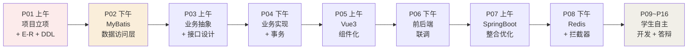

**今天上午的 DDL 是今天下午 MyBatis 的唯一输入**——做完这节课，下午就能直接"映射"成 Java 对象。

---

## 1. 先补一点背景（前置补丁）

> 只补本节 **真正用到**的 4 个前置点。已懂可跳到第 2 节。

### 1.1 数据库、表、字段、记录——它们长啥样？

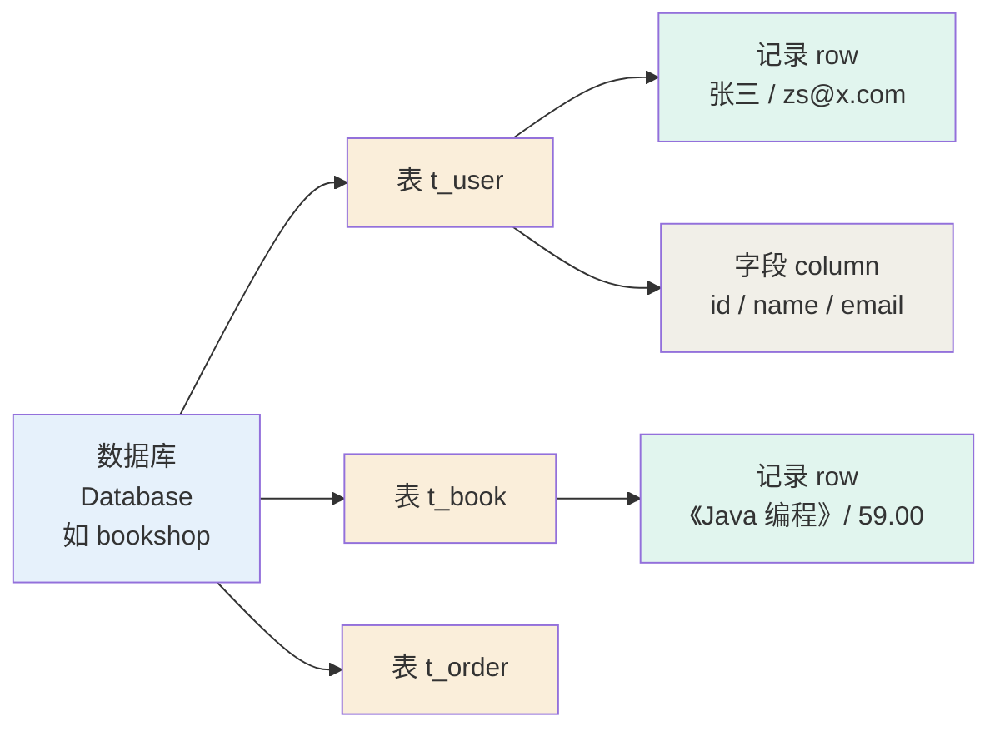

类比 Excel：工作簿 = 数据库，工作表 = 表，表头 = 字段，每一行 = 记录。

### 1.2 主键、外键——表的"身份证"和"血缘"

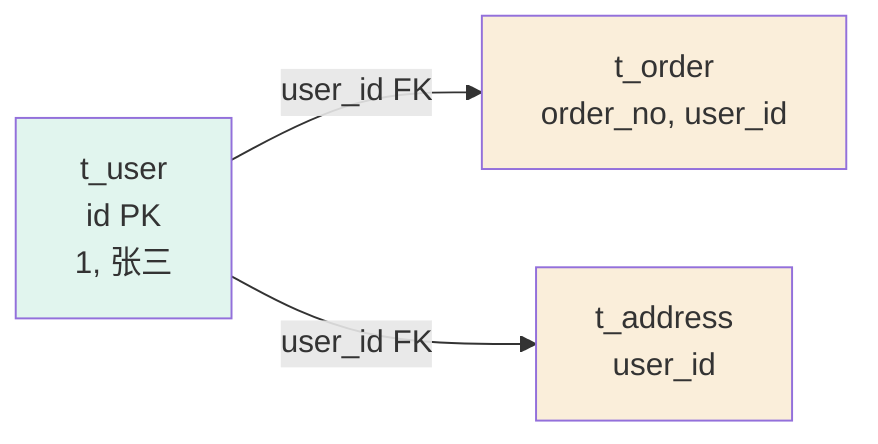

- **主键 PK**：能唯一标识一行。每张表必须有且只有一个（可组合）。
- **外键 FK**：引用别表的主键。子表→父表方向，不能引用不存在的父记录。

### 1.3 命令行基础——至少会这 4 条

```bash
mysql -u root -p            # 登录
SHOW DATABASES;             # 看所有数据库
USE bookshop;               # 选中数据库
SHOW TABLES;                # 看所有表
```

> 老师上课会用 Navicat / DBeaver 图形化工具，但 **期末答辩建议保留命令行截图**，证明你懂原理。

### 1.4 约束——数据的"防护栏"

约束是数据库 **强制执行**的规则。比应用层代码靠谱 100 倍：

| 约束 | 关键字                       | 例子                                            |
|------|------------------------------|-------------------------------------------------|
| 主键 | `PRIMARY KEY`                | `id INT PRIMARY KEY`                            |
| 唯一 | `UNIQUE`                     | `email VARCHAR(100) UNIQUE`                     |
| 非空 | `NOT NULL`                   | `name VARCHAR(50) NOT NULL`                     |
| 外键 | `FOREIGN KEY ... REFERENCES` | `user_id INT FOREIGN KEY REFERENCES t_user(id)` |

---

## 2. 核心概念

### 2.1 E-R 三要素——实体、属性、联系

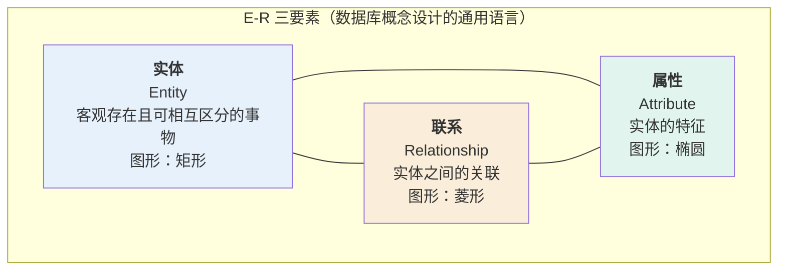

**判断正误**：

- ✅ 学生、图书、订单 → 实体
- ❌ 登录、注册、借书 → 不是实体（这是 **操作/联系**）
- ✅ 姓名、学号、价格 → 属性
- ❌ 注册流程 → 不是属性（这是 **动作**）

### 2.2 联系的三种基数

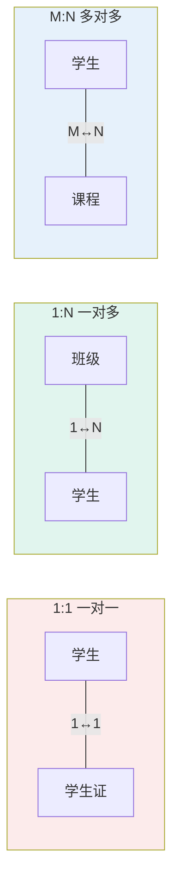

转表规则一句话：

| 联系类型 | 转表规则                                        |
|----------|-------------------------------------------------|
| 1:1      | 合并到任一方主键即可                            |
| 1:N      | 在 N 方加外键指向 1 方                          |
| **M:N**  | **必须新建第三张关联表**（双方主键 + 自身属性） |

### 2.3 三大范式——"你的表设计合理吗"的尺子

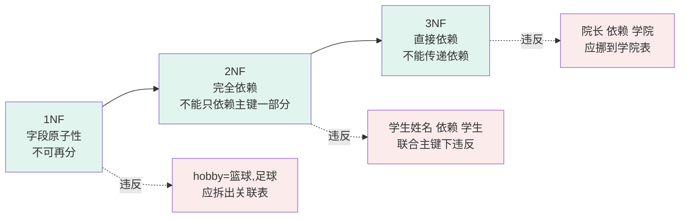

**工程经验**：满足到 3NF 就够，再高会过度设计（查询变慢）。

### 2.4 弱实体——"没有父就没我"


| 类型       | 含义                   | 删父表时                      |
|------------|------------------------|-------------------------------|
| **强实体** | 独立存在（学生、订单） | 子表不受影响                  |
| **弱实体** | 依赖父实体（订单明细） | 用 `ON DELETE CASCADE` 自动删 |

---

## 3. 本次重点知识

### 3.1 项目立项——5 步流程


每一步的产出：

| 步骤          | 产出                                        | 工具                            |
|---------------|---------------------------------------------|---------------------------------|
| 1. 选题       | 立项说明书（背景 + 用户 + 功能清单 ≥ 8 项） | Markdown                        |
| 2. 实体识别   | 实体清单（≥ 5 实体 × 3~5 属性）             | 纸笔 / 表格                     |
| 3. 画 E-R 图  | 全局 E-R 图（PNG）                          | Mermaid / PowerDesigner / PDMan |
| 4. 转关系模式 | 关系模式列表                                | 纸笔                            |
| 5. 导出 DDL   | `bookshop.sql`                              | AI / PowerDesigner 一键生成     |

### 3.2 实体识别——三类常见错

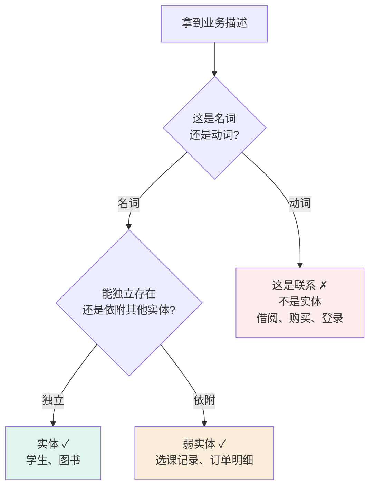

**两条黄金法则**：

1. **把字段当实体**——"性别""年龄"是字段，不是实体。
2. **把操作当实体**——"借书""还书"是联系，不是实体。

### 3.3 画 E-R 图——图书销售示例

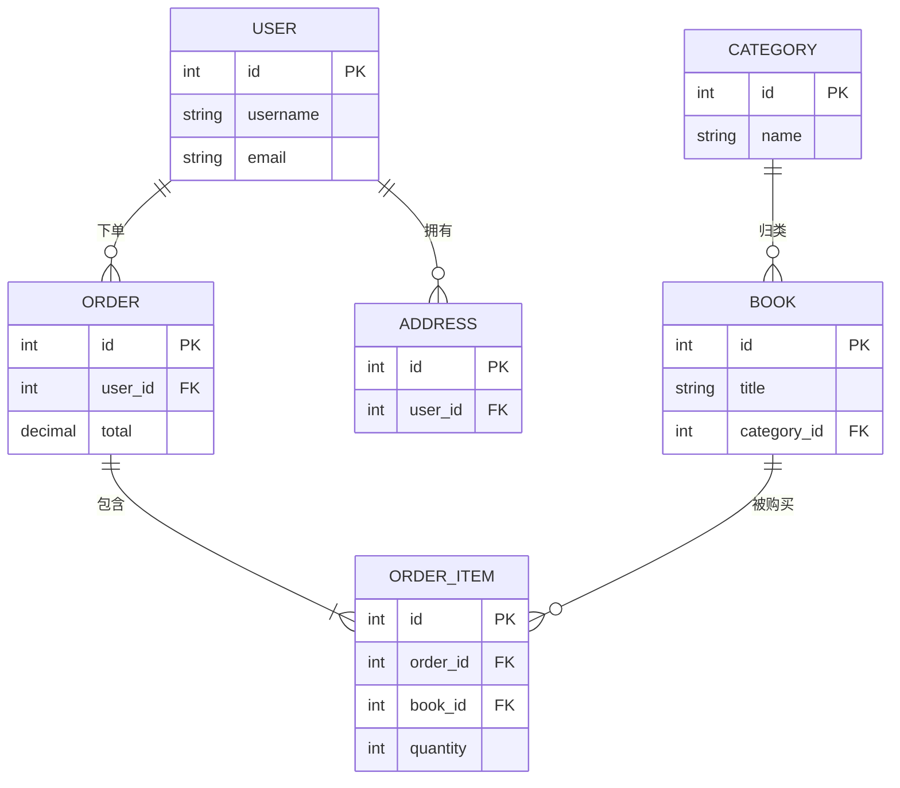

5 条硬规则：

1. 实体用 **矩形**
2. 属性用 **椭圆**
3. 联系用 **菱形**
4. M:N 必须 **独立成表**
5. 基数要标（线两端写 1 或 N）

### 3.4 E-R 转关系模式——决策树

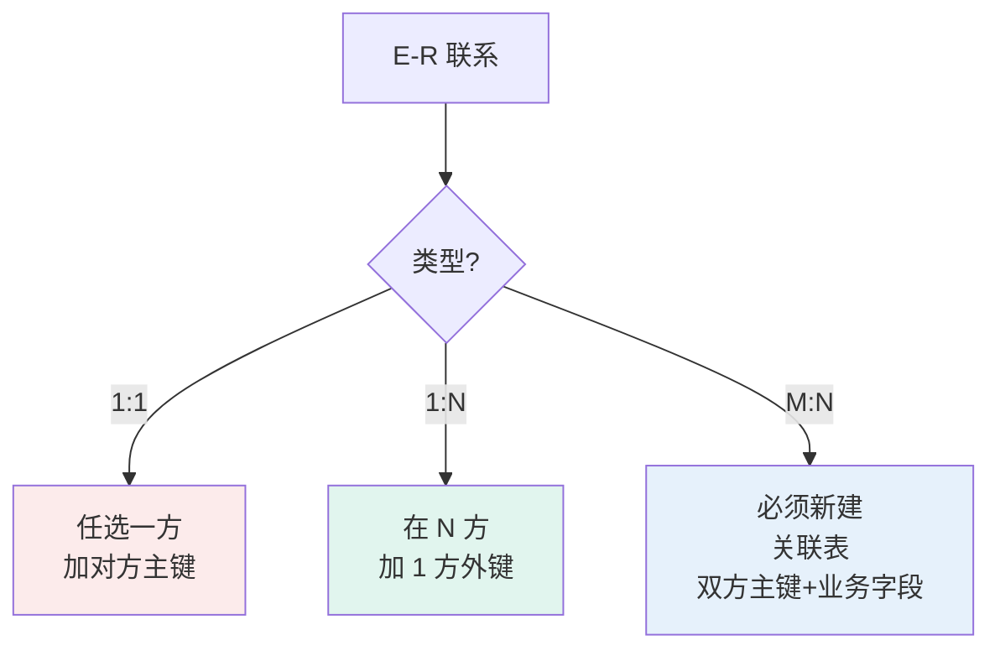

图书销售系统的转换结果：

| 联系      | 类型 | 转换                                   |
|-----------|------|----------------------------------------|
| 用户—订单 | 1:N  | `t_order.user_id` → `t_user.id`        |
| 用户—地址 | 1:N  | `t_address.user_id` → `t_user.id`      |
| 订单—明细 | 1:N  | `t_order_item.order_id` → `t_order.id` |
| 图书—明细 | 1:N  | `t_order_item.book_id` → `t_book.id`   |
| 分类—图书 | 1:N  | `t_book.category_id` → `t_category.id` |

---

## 4. 教学难点（重点化解）

### 4.1 难点①：M:N 联系转关联表时的主键设计

**场景**：学生—选课—课程（M:N）。

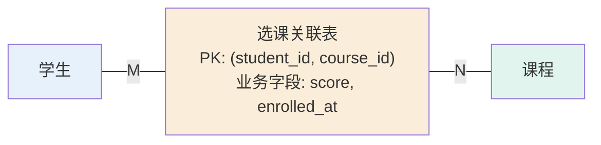

**正解**：

```sql
CREATE TABLE t_student_course
(
    student_id  INT      NOT NULL,
    course_id   INT      NOT NULL,
    score       DECIMAL(5, 2)     DEFAULT NULL, -- 业务字段别忘加
    enrolled_at DATETIME NOT NULL DEFAULT CURRENT_TIMESTAMP,
    PRIMARY KEY (student_id, course_id),        -- 联合主键
    FOREIGN KEY (student_id) REFERENCES t_student (id),
    FOREIGN KEY (course_id) REFERENCES t_course (id)
);
```

**化解口诀**：主键用联合， **业务字段（成绩、时间）别忘加**——后补改不动。

### 4.2 难点②：弱实体的主键与级联删除

**场景**：订单明细依赖订单。

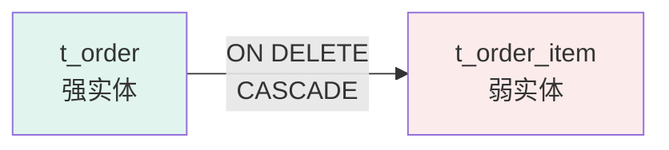

**正解**：

```sql
CREATE TABLE t_order_item
(
    id       INT AUTO_INCREMENT PRIMARY KEY,                         -- 自己主键
    order_id INT NOT NULL,
    book_id  INT NOT NULL,
    FOREIGN KEY (order_id) REFERENCES t_order (id) ON DELETE CASCADE -- 级联删
);
```

**识别口诀**："没有父实体，子实体能不能独立存在？"——不能就是弱实体，加 `ON DELETE CASCADE`。

### 4.3 难点③：同一业务多种建模方案怎么取舍

**场景**：商品—分类，单级还是多级？

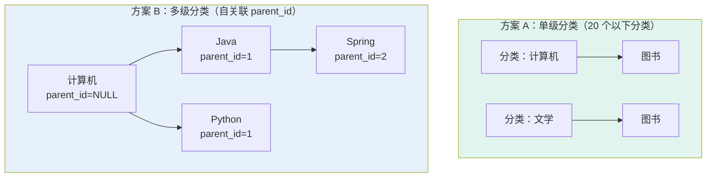

**取舍三问**：

1. **范式合规吗？** ——两个方案都满足 3NF。
2. **查询频率？** ——经常查"二级分类下所有商品"→ 方案 B 更省 JOIN。
3. **维护成本？** ——多级分类意味着前端无限层级组件，工期翻倍。

**工程经验**：分类 < 20 个 → 方案 A；分类 ≥ 20 个、可能改 → 方案 B。

---

## 5. 跟着做一遍（完整可复现流程）

### 5.1 准备（5 分钟）

启动 MySQL 8.0 + PowerDesigner / PDMan。

### 5.2 画 E-R 图（10 分钟）

按 3.3 节的图，在工具里画出来。重点是 5 个核心实体和 5 条联系。

### 5.3 生成 DDL（5 分钟）

PowerDesigner：`Database → Generate Database`，选 MySQL 8.0 + UTF-8。

### 5.4 执行验证（5 分钟）

```bash
mysql -u root -p < bookshop.sql
mysql -u root -p -e "USE bookshop; SHOW TABLES;"
```

**预期结果**：6 张表（`t_user`、`t_book`、`t_category`、`t_order`、`t_order_item`、`t_address`），脚本 **无 warning**。

### 5.5 完整 DDL 脚本（直接复制可用）

```sql
-- 图书销售系统 / 数据库：bookshop / MySQL 8.0+ / utf8mb4

DROP DATABASE IF EXISTS bookshop;
CREATE DATABASE bookshop DEFAULT CHARACTER SET utf8mb4 DEFAULT COLLATE utf8mb4_unicode_ci;
USE bookshop;

CREATE TABLE t_user
(
    id         INT AUTO_INCREMENT PRIMARY KEY COMMENT '用户ID，主键',
    username   VARCHAR(50)  NOT NULL UNIQUE COMMENT '用户名，唯一',
    password   VARCHAR(100) NOT NULL COMMENT '密码（须 BCrypt 加密）',
    email      VARCHAR(100) UNIQUE COMMENT '邮箱',
    phone      VARCHAR(20) COMMENT '手机号',
    status     TINYINT      NOT NULL DEFAULT 1 COMMENT '1=正常，0=禁用',
    created_at DATETIME     NOT NULL DEFAULT CURRENT_TIMESTAMP,
    updated_at DATETIME     NOT NULL DEFAULT CURRENT_TIMESTAMP ON UPDATE CURRENT_TIMESTAMP
) ENGINE = InnoDB COMMENT ='用户表';

CREATE TABLE t_category
(
    id         INT AUTO_INCREMENT PRIMARY KEY COMMENT '分类ID',
    name       VARCHAR(50) NOT NULL COMMENT '分类名',
    parent_id  INT                  DEFAULT NULL COMMENT '父分类ID，顶级为NULL',
    sort_order INT         NOT NULL DEFAULT 0 COMMENT '排序',
    FOREIGN KEY (parent_id) REFERENCES t_category (id) ON DELETE SET NULL ON UPDATE CASCADE
) ENGINE = InnoDB COMMENT ='分类表（自关联，支持多级）';

CREATE TABLE t_book
(
    id          INT AUTO_INCREMENT PRIMARY KEY COMMENT '图书ID',
    title       VARCHAR(200)   NOT NULL COMMENT '书名',
    author      VARCHAR(100)   NOT NULL COMMENT '作者',
    isbn        VARCHAR(20)    NOT NULL UNIQUE COMMENT 'ISBN',
    price       DECIMAL(10, 2) NOT NULL COMMENT '价格',
    stock       INT            NOT NULL DEFAULT 0 COMMENT '库存',
    cover_url   VARCHAR(255) COMMENT '封面URL',
    description TEXT COMMENT '描述',
    category_id INT            NOT NULL COMMENT '分类ID',
    status      TINYINT        NOT NULL DEFAULT 1 COMMENT '1=在售，0=下架',
    created_at  DATETIME       NOT NULL DEFAULT CURRENT_TIMESTAMP,
    updated_at  DATETIME       NOT NULL DEFAULT CURRENT_TIMESTAMP ON UPDATE CURRENT_TIMESTAMP,
    FOREIGN KEY (category_id) REFERENCES t_category (id) ON DELETE RESTRICT ON UPDATE CASCADE
) ENGINE = InnoDB COMMENT ='图书表';
CREATE INDEX idx_book_title ON t_book (title);

CREATE TABLE t_address
(
    id         INT AUTO_INCREMENT PRIMARY KEY COMMENT '地址ID',
    user_id    INT          NOT NULL COMMENT '所属用户ID',
    receiver   VARCHAR(50)  NOT NULL COMMENT '收货人',
    phone      VARCHAR(20)  NOT NULL COMMENT '电话',
    province   VARCHAR(20)  NOT NULL COMMENT '省',
    city       VARCHAR(20)  NOT NULL COMMENT '市',
    detail     VARCHAR(200) NOT NULL COMMENT '详细地址',
    is_default TINYINT      NOT NULL DEFAULT 0 COMMENT '是否默认',
    FOREIGN KEY (user_id) REFERENCES t_user (id) ON DELETE CASCADE ON UPDATE CASCADE
) ENGINE = InnoDB COMMENT ='收货地址表';

CREATE TABLE t_order
(
    id           INT AUTO_INCREMENT PRIMARY KEY COMMENT '订单ID',
    order_no     VARCHAR(32)    NOT NULL UNIQUE COMMENT '订单号',
    user_id      INT            NOT NULL COMMENT '用户ID',
    total_amount DECIMAL(10, 2) NOT NULL COMMENT '总金额',
    status       TINYINT        NOT NULL DEFAULT 0 COMMENT '0=待支付，1=已支付，2=已发货，3=已完成，4=已取消',
    receiver     VARCHAR(200)   NOT NULL COMMENT '收货信息（快照）',
    created_at   DATETIME       NOT NULL DEFAULT CURRENT_TIMESTAMP,
    paid_at      DATETIME                DEFAULT NULL,
    FOREIGN KEY (user_id) REFERENCES t_user (id) ON DELETE RESTRICT ON UPDATE CASCADE
) ENGINE = InnoDB COMMENT ='订单表';
CREATE INDEX idx_order_user ON t_order (user_id);

CREATE TABLE t_order_item
(
    id       INT AUTO_INCREMENT PRIMARY KEY COMMENT '明细ID',
    order_id INT            NOT NULL COMMENT '订单ID',
    book_id  INT            NOT NULL COMMENT '图书ID',
    quantity INT            NOT NULL COMMENT '数量',
    price    DECIMAL(10, 2) NOT NULL COMMENT '下单时单价（快照）',
    FOREIGN KEY (order_id) REFERENCES t_order (id) ON DELETE CASCADE ON UPDATE CASCADE,
    FOREIGN KEY (book_id) REFERENCES t_book (id) ON DELETE RESTRICT ON UPDATE CASCADE
) ENGINE = InnoDB COMMENT ='订单明细（M:N 关联表）';
CREATE INDEX idx_item_order ON t_order_item (order_id);
```

---

## 6. 关联知识

### 6.2 向前铺垫

| 伏笔                              | 哪天用  | 怎么用                             |
|-----------------------------------|---------|------------------------------------|
| `username UNIQUE`                 | W1 下午 | MyBatis 登录：`WHERE username = ?` |
| `order_no UNIQUE`                 | W2 下午 | 业务流水号（雪花算法 / UUID）      |
| `stock INT DEFAULT 0`             | W2 下午 | 下单时事务扣减库存                 |
| `t_order_item` 联合外键           | W4 上午 | 整合优化：批量插入性能             |
| `parent_id` 自关联                | W5~W8   | 自主开发：分类树查询               |
| `ON DELETE CASCADE` vs `RESTRICT` | W7 下午 | 安全加固章节讨论                   |

### 6.3 提前打个预防针

| 现在的写法          | 后续会变成                                 | 时机                |
|---------------------|--------------------------------------------|---------------------|
| `password` 明文占位 | BCrypt 哈希（约 60 字符）                  | 第 1 次登录后必须改 |
| `stock` 无并发控制  | 乐观锁 / Redis 分布式锁                    | W2 下午事务课       |
| 单库单表            | 分库分表（预留 `user_id` 作 sharding key） | 大项目阶段          |

---

## 7. 常见错误与排查

| # | 现象                                          | 原因                                      | 怎么改                              |
|---|-----------------------------------------------|-------------------------------------------|-------------------------------------|
| 1 | `ERROR 1062: Duplicate entry`                 | 主键/唯一键冲突                           | 查重复数据，或确认 `AUTO_INCREMENT` |
| 2 | `ERROR 1452: Child row not found`             | 外键引用了不存在的父记录                  | 先插父表，再插子表                  |
| 3 | `ERROR 1005: Can't create table (errno: 150)` | 外键字段类型与父表主键不一致              | 统一 INT/BIGINT                     |
| 4 | 中文变 `?????`                                | 字符集不是 utf8mb4                        | 表加 `DEFAULT CHARSET=utf8mb4`      |
| 5 | E-R 生成 DDL 没外键                           | PowerDesigner 没勾 "Generate FK"          | 选项里勾选                          |
| 6 | 同一订单同一本书想重复添加失败                | 联合主键 `(order_id, book_id)` 不允许重复 | 改用单独 `id` 主键 + 联合唯一约束   |
| 7 | 删父表记录，子表还在                          | 没设 `ON DELETE CASCADE`                  | 加 CASCADE                          |
| 8 | `show tables` 显示 0 张表但脚本执行没报错     | `USE database` 没生效                     | 脚本头部加 `USE bookshop;`          |

**万能排查顺序**：

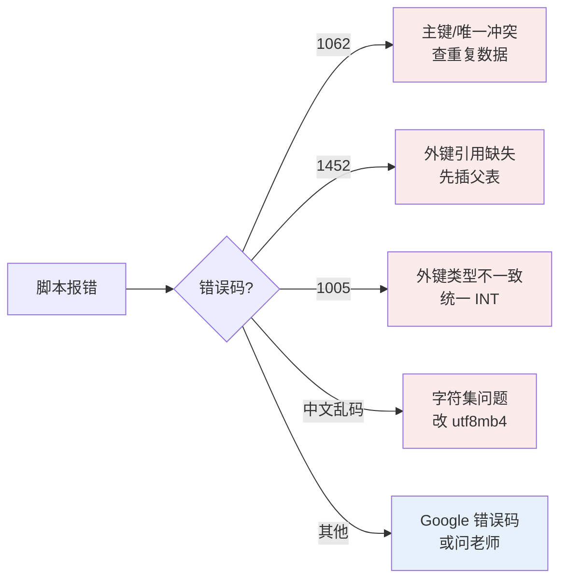

---

## 8. 术语速查表

| 术语    | 一句话解释                           |
|---------|--------------------------------------|
| 实体    | 客观存在且可相互区分的事物           |
| 属性    | 实体的特征                           |
| 联系    | 实体之间的关联                       |
| 主键 PK | 唯一标识一行                         |
| 外键 FK | 引用别表主键                         |
| 基数    | 联系的数量关系（1:1/1:N/M:N）        |
| 弱实体  | 依赖父实体存在的实体                 |
| 范式    | 表设计合理性的标准                   |
| DDL     | 数据定义语言（CREATE/DROP/ALTER）    |
| DML     | 数据操作语言（INSERT/UPDATE/DELETE） |
| 字符集  | 存储字符的编码（推荐 utf8mb4）       |
| 引擎    | MySQL 存储引擎（推荐 InnoDB）        |

---

## 9. 自检清单（8 问）

| # | 问题                                                    | 回看 |
|---|---------------------------------------------------------|------|
| 1 | 我能用一句话说出"为什么要先做数据库设计"吗？            | 0.1  |
| 2 | 我能画出 E-R 图三要素的图形约定吗？                     | 2.1  |
| 3 | 我能区分 1:1/1:N/M:N 并写出各自的转表规则吗？           | 2.2  |
| 4 | 我能口述三大范式的判定标准吗？                          | 2.3  |
| 5 | 我能在 30 分钟内画出一个真实业务的全局 E-R 图吗？       | 3.3  |
| 6 | 我能独立写出 ≥ 5 张表的 DDL（含外键 + 注释 + 索引）吗？ | 5.5  |
| 7 | 我能解释"弱实体"是什么、怎么识别、怎么建模吗？          | 4.2  |
| 8 | 我能排查 1062/1452/1005 三类常见 DDL 错误吗？           | 7    |

> 8 题全 ✅ → 放心去做下午的 MyBatis。
> 任意 ❌ → 回看对应章节，或问老师。

---

## 10. 课后任务

| # | 任务                                                            | 截止       | 提交                       |
|---|-----------------------------------------------------------------|------------|----------------------------|
| 1 | 完成实验报告（含 3 项成果截图 + 代码片段）                      | 下次上课前 | gitee `docs/P01-report.md` |
| 2 | 预习下午课"MyBatis 数据访问层实现"——读 MyBatis 官方 Quick Start | 下次上课前 | 读完即可                   |
| 3 | （学有余力）补充索引（按高频查询字段）                          | 下次上课前 | 更新 `db/bookshop.sql`     |

**实验报告模板**：

```markdown
# P01 项目立项与数据库设计 · 实验报告

## 1. 实验目的

## 2. 实验步骤（按 3.1 五步简述）

## 3. 实验成果

- 立项说明书：[链接]
- E-R 图：[截图]
- DDL 脚本：[链接]
- show tables 截图：[图片]

## 4. 遇到的问题与解决（≥ 1 条）

## 5. 心得体会（≥ 200 字）
```

---

## 附：本课配套代码

```
技术文档/resources/P01-bookshop/
├── bookshop.sql                    # 第 5.5 节的完整 DDL 脚本（直接可用）
├── P01-er-diagram.png              # 图书销售系统 E-R 图（高清）
└── README.md                       # 配套说明
```

> 💡 请以本文档代码为准——教材或 PPT 的旧示例可能用了不同命名/字符集。