# P02 · 实验项目 1（下午）：基于 MyBatis 的数据访问层实现

> 对应教案：第 01 周·实践课·第 02 次（下午）·实验项目 1·下午
> 学时：2 学时｜ 上课时间：第 1 周｜ 地点：实验机房
> 配套代码：`技术文档/resources/P02-bookshop-dao/`
> 前置：P01（项目立项与数据库设计）必须先做完
> 一句话定位： **把上午的"数据库表"映射成"Java 对象 + CRUD 方法"——从此 Java 不用手写 JDBC 了。**

---

## 图表显示说明

本文档的图形用 **Mermaid** 语法绘制，需要支持 Mermaid 的阅读器才能看到图形：

| 阅读方式            | 要求                                |
|---------------------|-------------------------------------|
| **VS Code**（推荐） | 内置预览，按 `Ctrl/Cmd + Shift + V` |
| **Gitee / GitHub**  | 原生支持                            |

图形只是辅助理解， **每张图附近的正文都有等价的文字说明**，即使不出图也不影响阅读。

---

## 0. 先搞清楚这节课在干什么

### 0.1 上午画了 E-R 图，下午干什么？

上午你交了 3 份成果：立项说明书、E-R 图、DDL 脚本。但这些只是 **死的字符**——MySQL 不会主动告诉 Java "我有哪些表、有哪些字段"。Java 也读不懂 SQL。

下午的目标就是把数据库表 **翻译成 Java 代码**：

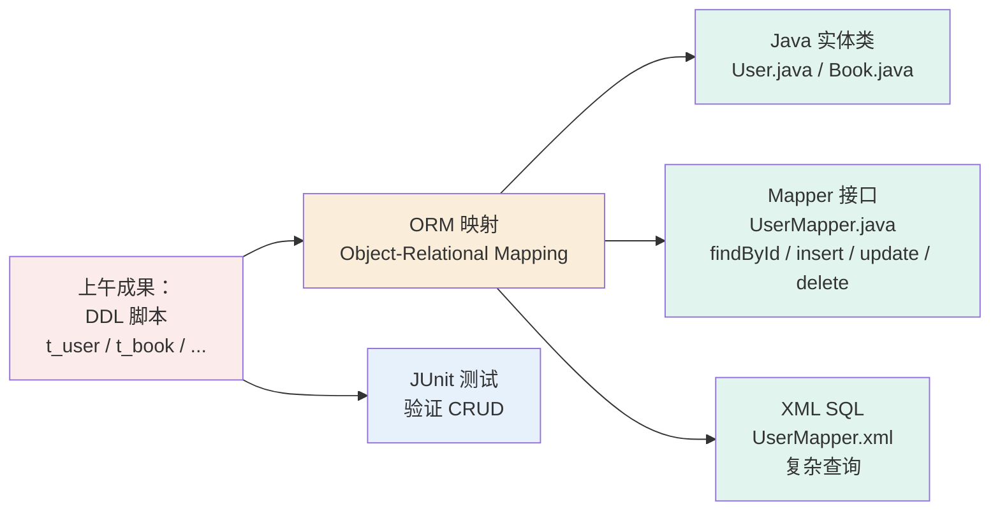

**MyBatis 的核心价值**：让 Java 程序员继续写 SQL（不强制用 HQL / JPQL），同时享受"自动加载结果到对象"的便利—— **SQL 与 Java 代码解耦**。

### 0.2 学完你应该能做到（下课前 3 项学习成果）

| 编号      | 成果                          | 验收最低标准                                                      |
|-----------|-------------------------------|-------------------------------------------------------------------|
| **成果①** | SpringBoot + MyBatis 项目骨架 | 项目能 `mvn spring-boot:run` 启动，连上 MySQL                     |
| **成果②** | 上午实体的 POJO + Mapper 接口 | ≥ 5 个实体 + ≥ 5 个 Mapper，含核心 CRUD + 1 个关联查询            |
| **成果③** | JUnit 测试报告                | 覆盖 insert/selectById/updateById/deleteById + 关联查询，全部通过 |

### 0.3 这节课在整门课的位置

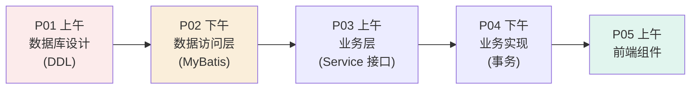

P02 是把 DDL **激活**成可调用代码的关键一步。没这一步，后面的 Service、Controller 全部跑不起来。

---

## 1. 先补一点背景（前置补丁）

### 1.1 ORM 是什么？

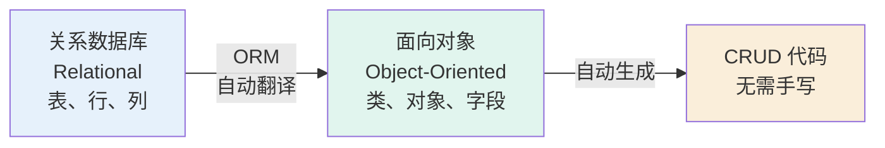

| ORM 流派       | 代表框架        | 特点                                |
|----------------|-----------------|-------------------------------------|
| **全自动映射** | Hibernate / JPA | 几乎不写 SQL，Java 方法直接生成 SQL |
| **半自动映射** | **MyBatis**     | 还是要写 SQL，但自动把结果填进对象  |
| **纯手写**     | JDBC            | 最灵活但最啰嗦                      |

> 本课程用 **MyBatis-Plus**（在 MyBatis 基础上封装了更多便捷方法），但 SQL 仍需手写。

### 1.2 Maven 是什么？

Maven = **项目管理工具**，帮你：

1. 下载依赖包（不用手动 `jar` 拷贝）
2. 编译代码
3. 跑测试
4. 打成可运行的 `jar`

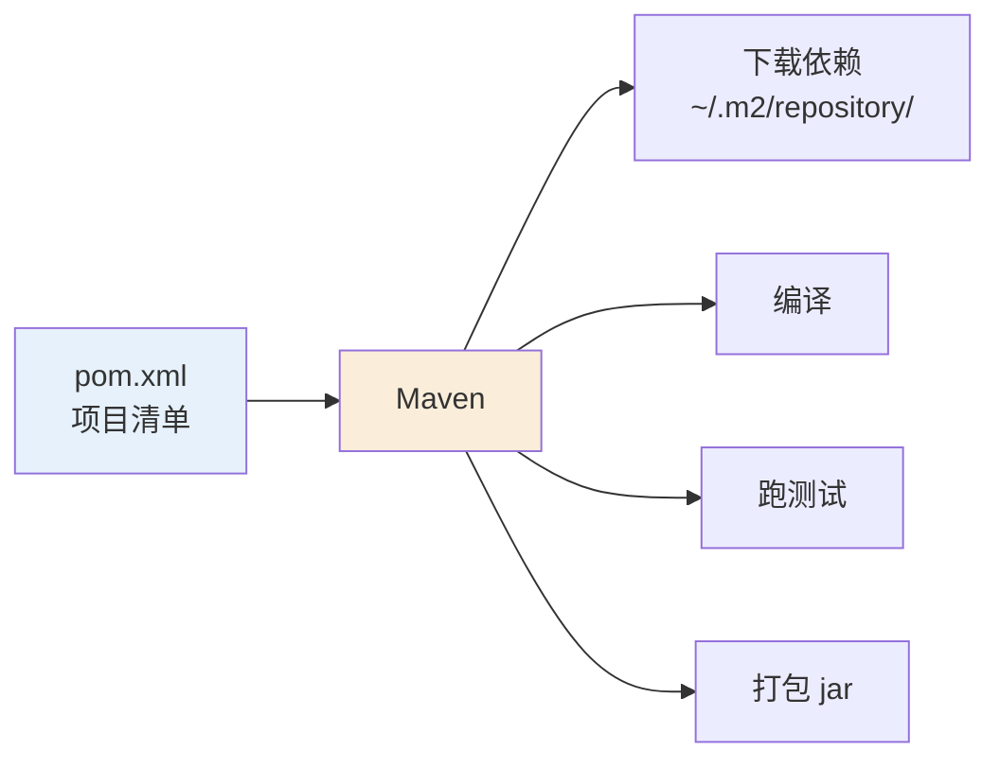

### 1.3 注解基础——你这一节课至少要懂这 5 个

| 注解                           | 作用                             | 示例                                        |
|--------------------------------|----------------------------------|---------------------------------------------|
| `@SpringBootApplication`       | 标记 SpringBoot 启动类           | 放在 `main` 方法的类上                      |
| `@Service`                     | 标记业务类（让 Spring 自动注入） | `@Service public class UserServiceImpl`     |
| `@Autowired`                   | 自动注入依赖                     | `@Autowired private UserMapper userMapper;` |
| `@TableName("t_user")`         | MyBatis-Plus：实体对应表名       | 实体类上                                    |
| `@TableId(type = IdType.AUTO)` | MyBatis-Plus：主键策略           | 主键字段上                                  |

---

## 2. 核心概念

### 2.1 MyBatis 的三层架构定位

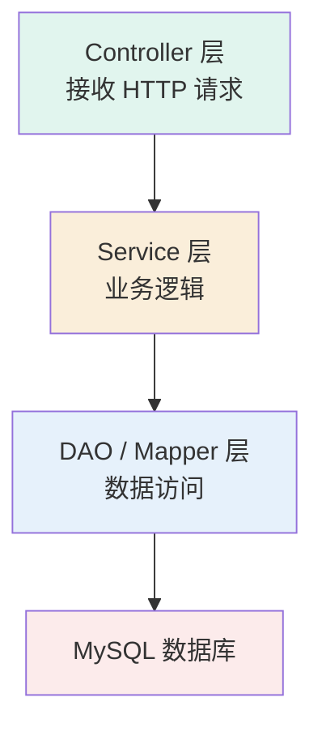

MyBatis **只负责 DAO 层**——它不管 Controller、不管业务逻辑。**

### 2.2 POJO / Entity / VO / DTO 区别

| 类型              | 全称                  | 用途               | 例子                               |
|-------------------|-----------------------|--------------------|------------------------------------|
| **POJO / Entity** | Plain Old Java Object | 与数据库表一一对应 | `User`、`Book`、`Order`            |
| **VO**            | View Object           | 返回给前端的对象   | `UserVO`（含 `password` 字段过滤） |
| **DTO**           | Data Transfer Object  | 接收前端参数的对象 | `UserDTO`（含校验注解）            |

> 本节课我们只写 **POJO**。

### 2.3 resultType vs resultMap——结果映射两兄弟

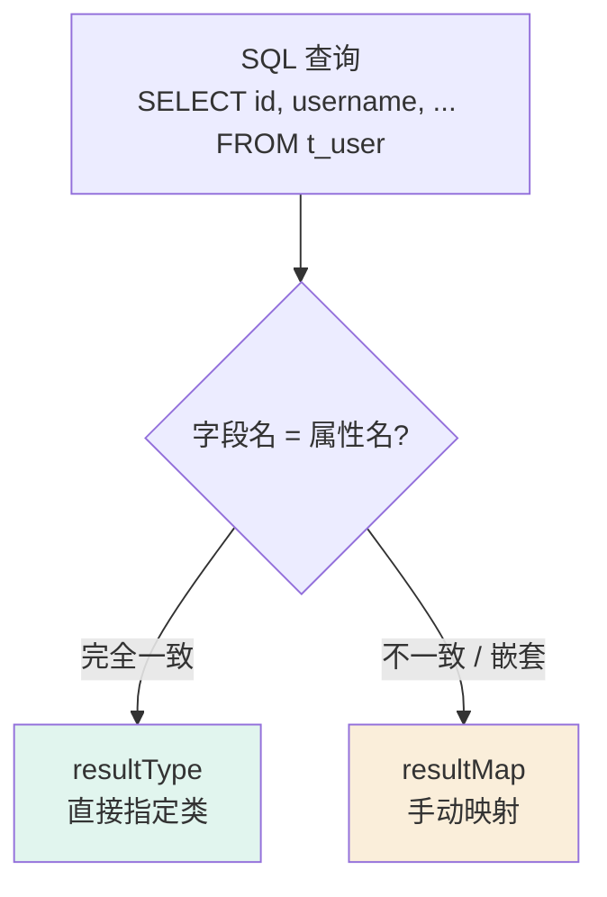

**何时用哪个**：

| 场景                                        | 用 resultType                 | 用 resultMap |
|---------------------------------------------|-------------------------------|--------------|
| 单表查询、字段名 = 属性名                   | ✅                            | 也能用       |
| **驼峰 vs 下划线**（user_name → username）  | 开启 mapUnderscoreToCamelCase | 否则需要     |
| 关联查询（订单 + 用户）                     | 不行                          | ✅           |
| 字段重命名（DB 字段叫 `uid`，Java 叫 `id`） | 不行                          | ✅           |

### 2.4 动态 SQL——MyBatis 最强特性

动态 SQL 让 **一条 SQL 根据条件自动拼装**：

```xml
<select id="searchBooks" resultType="Book">
    SELECT * FROM t_book
    <where>
        <if test="title != null">
            AND title LIKE CONCAT('%', #{title}, '%')
        </if>
        <if test="author != null">
            AND author = #{author}
        </if>
    </where>
</select>
```

`WHERE` 标签会自动处理 **首个 AND/OR**——避免拼出 `WHERE AND ...` 的语法错误。

---

## 3. 本次重点知识

### 3.1 4 步流程

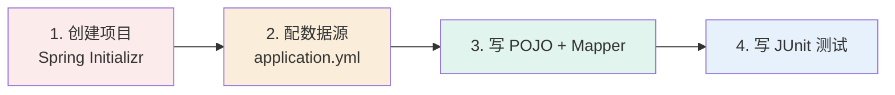

### 3.2 步骤 1：创建 SpringBoot 项目（5 分钟）

用 Spring Initializr（https://start.spring.io/）：

| 选项         | 选择                                               |
|--------------|----------------------------------------------------|
| Project      | Maven                                              |
| Language     | Java                                               |
| Spring Boot  | 3.x（最新稳定版）                                  |
| Java         | 17                                                 |
| Dependencies | **Spring Web**、**MyBatis-Plus**、**MySQL Driver** |

下载后用 IDEA 打开。

### 3.3 步骤 2：配置数据源（5 分钟）

`src/main/resources/application.yml`：

```yaml
spring:
  datasource:
    url: jdbc:mysql://localhost:3306/bookshop?useUnicode=true&characterEncoding=utf8&serverTimezone=Asia/Shanghai
    username: root
    password: 你的密码           # ⚠️ 不要提交到 gitee！
    driver-class-name: com.mysql.cj.jdbc.Driver

mybatis-plus:
  configuration:
    map-underscore-to-camel-case: true     # user_name → username 自动映射
    log-impl: org.apache.ibatis.logging.stdout.StdOutImpl   # 调试时打印 SQL
  global-config:
    db-config:
      id-type: auto

# 重要：Mapper 接口扫描路径
mybatis-plus:
  mapper-locations: classpath:mapper/**/*.xml
```

启动类加 `@MapperScan`：

```java
@SpringBootApplication
@MapperScan("com.example.bookshop.mapper")    // 改成你的包名
public class BookshopApplication {
    public static void main(String[] args) {
        SpringApplication.run(BookshopApplication.class, args);
    }
}
```

### 3.4 步骤 3：写 POJO 和 Mapper（30 分钟）

**User.java**（POJO）：

```java
package com.example.bookshop.entity;

import com.baomidou.mybatisplus.annotation.IdType;
import com.baomidou.mybatisplus.annotation.TableId;
import com.baomidou.mybatisplus.annotation.TableName;
import lombok.Data;

@Data                                           // Lombok：自动生成 getter/setter
@TableName("t_user")                            // 对应上午建的 t_user 表
public class User {

    @TableId(type = IdType.AUTO)               // 主键自增
    private Integer id;

    private String username;
    private String password;
    private String email;
    private String phone;
    private Integer status;
    private LocalDateTime createdAt;           // 注意驼峰 → created_at 自动映射
    private LocalDateTime updatedAt;
}
```

> ⚠️ **必须装 Lombok 插件**（IDEA 设置 → Plugins → 搜 Lombok → Install）。否则 `@Data` 不生效。

**UserMapper.java**（接口）：

```java
package com.example.bookshop.mapper;

import com.baomidou.mybatisplus.core.mapper.BaseMapper;
import com.example.bookshop.entity.User;
import org.apache.ibatis.annotations.Mapper;
import org.apache.ibatis.annotations.Param;

import java.util.List;

@Mapper
public interface UserMapper extends BaseMapper<User> {
    // BaseMapper<User> 已经提供了：
    //   insert(User), deleteById(int), updateById(User), selectById(int), selectList(...)
    // 你只需要写"复杂查询"

    // 关联查询示例：根据用户 id 查用户 + 该用户的所有订单
    User selectUserWithOrders(@Param("userId") Integer userId);

    // 动态 SQL 示例：按 username / email 模糊查询
    List<User> searchUsers(@Param("username") String username,
                           @Param("email") String email);
}
```

**UserMapper.xml**（SQL 映射）：

```xml
<?xml version="1.0" encoding="UTF-8" ?>
<!DOCTYPE mapper PUBLIC "-//mybatis.org//DTD Mapper 3.0//EN"
        "http://mybatis.org/dtd/mybatis-3-mapper.dtd">

<mapper namespace="com.example.bookshop.mapper.UserMapper">

    <!-- 关联查询：用户 + 订单列表（resultMap 嵌套） -->
    <resultMap id="UserWithOrdersMap" type="User">
        <id column="id" property="id"/>
        <result column="username" property="username"/>
        <result column="email" property="email"/>
        <!-- 一对多：订单列表 -->
        <collection property="orders" ofType="Order">
            <id column="order_id" property="id"/>
            <result column="total_amount" property="totalAmount"/>
            <result column="status" property="status"/>
        </collection>
    </resultMap>

    <select id="selectUserWithOrders" resultMap="UserWithOrdersMap">
        SELECT u.id, u.username, u.email,
               o.id AS order_id, o.total_amount, o.status
        FROM t_user u
        LEFT JOIN t_order o ON o.user_id = u.id
        WHERE u.id = #{userId}
    </select>

    <!-- 动态 SQL 模糊查询 -->
    <select id="searchUsers" resultType="User">
        SELECT * FROM t_user
        <where>
            <if test="username != null and username != ''">
                AND username LIKE CONCAT('%', #{username}, '%')
            </if>
            <if test="email != null and email != ''">
                AND email LIKE CONCAT('%', #{email}, '%')
            </if>
        </where>
        ORDER BY id DESC
    </select>
</mapper>
```

> 注意 `User` 类里要加 `private List<Order> orders;` 字段才能接住关联结果。

### 3.5 步骤 4：JUnit 5 测试（15 分钟）

```java
package com.example.bookshop.mapper;

import com.example.bookshop.entity.User;
import org.junit.jupiter.api.Test;
import org.springframework.beans.factory.annotation.Autowired;
import org.springframework.boot.test.context.SpringBootTest;

import static org.junit.jupiter.api.Assertions.*;

@SpringBootTest
class UserMapperTest {

    @Autowired
    private UserMapper userMapper;

    @Test
    void testInsert() {
        User user = new User();
        user.setUsername("zhangsan");
        user.setPassword("123456");
        user.setEmail("zs@x.com");
        user.setPhone("13800000000");
        int rows = userMapper.insert(user);
        assertEquals(1, rows);                  // 断言插入了 1 行
        assertNotNull(user.getId());             // 自增 ID 应该回填
    }

    @Test
    void testSelectById() {
        User user = userMapper.selectById(1);
        assertNotNull(user);
        assertEquals(1, user.getId());
    }

    @Test
    void testUpdateById() {
        User user = userMapper.selectById(1);
        user.setEmail("new_email@x.com");
        int rows = userMapper.updateById(user);
        assertEquals(1, rows);
    }

    @Test
    void testDeleteById() {
        // 先插入，再删除
        User user = new User();
        user.setUsername("to_delete");
        userMapper.insert(user);
        int rows = userMapper.deleteById(user.getId());
        assertEquals(1, rows);
    }

    @Test
    void testSelectUserWithOrders() {
        User user = userMapper.selectUserWithOrders(1);
        assertNotNull(user);
        assertNotNull(user.getOrders());        // 订单列表不应为 null
        // 如果用 1 个有订单的用户测试，订单数应 > 0
    }
}
```

运行：IDEA 右键 → `Run 'UserMapperTest'`。

**预期结果**：5 个测试全部绿色 ✅。

---

## 4. 教学难点（重点化解）

### 4.1 难点①：字段命名不一致导致映射失败

**场景**：DB 字段 `user_name`，Java 字段 `username`，结果查出来是 `null`。

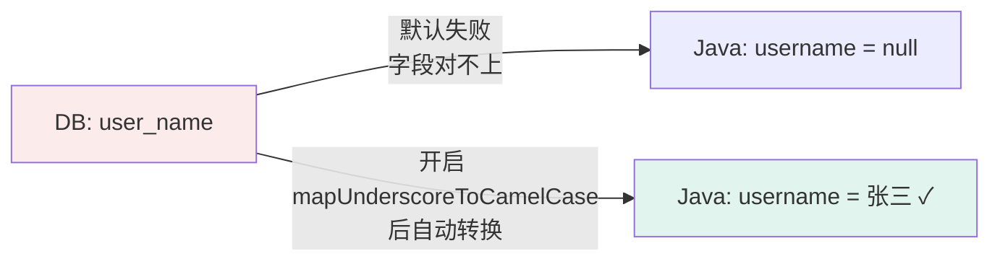

**化解**：`application.yml` 加：

```yaml
mybatis-plus:
  configuration:
    map-underscore-to-camel-case: true   # 全局驼峰转换
```

> 命名约定：DB 用 snake_case（`user_name`），Java 用 camelCase（`userName`）。这一行配置一劳永逸。

### 4.2 难点②：关联查询的 resultMap 嵌套写法

**场景**：订单要带"用户名称"信息。

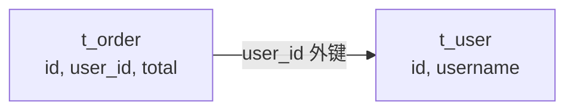

**错的写法**（用 resultType 直接接）：

```xml
<select id="selectOrders" resultType="Order">
    SELECT o.*, u.username AS user_name
    FROM t_order o LEFT JOIN t_user u ON o.user_id = u.id
</select>
```

→ `Order` 类里没 `userName` 字段，接不住。

**对的写法**（用 resultMap）：

```xml
<resultMap id="OrderWithUserMap" type="Order">
    <id column="id" property="id"/>
    <result column="total_amount" property="totalAmount"/>
    <!-- 关联：订单 → 用户（多对一） -->
    <association property="user" javaType="User">
        <id column="user_id" property="id"/>
        <result column="username" property="username"/>
    </association>
</resultMap>

<select id="selectOrders" resultMap="OrderWithUserMap">
    SELECT o.*, u.username
    FROM t_order o LEFT JOIN t_user u ON o.user_id = u.id
</select>
```

> `Order` 类里加 `private User user;` 字段。

**口诀**：单表用 `resultType`，关联用 `resultMap`，别忘加关联字段到 POJO。

### 4.3 难点③：动态 SQL 在批量删除中的正确拼装

**场景**：按 ids 批量删除图书，ids 可能是 1 个、10 个、或空。

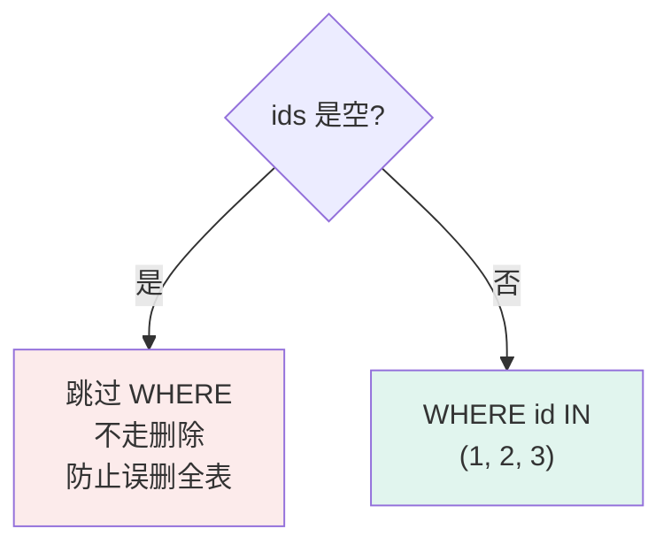

**正解**（用 `<foreach>`）：

```xml
<delete id="batchDelete">
    DELETE FROM t_book
    WHERE id IN
    <foreach collection="ids" item="id" open="(" separator="," close=")">
        #{id}
    </foreach>
</delete>
```

```java
int batchDelete(@Param("ids") List<Integer> ids);
```

**踩坑提醒**：

- `open="(" close=")"` 必须有，否则拼出 `IN 1,2,3` 报错。
- `separator=","` 不要写成 `","`——这里 separator 是字面字符。
- **ids 为空时一定要拦截**（在 Service 层判断），否则 `IN ()` 仍可能误删全表。

---

## 5. 跟着做一遍（完整可复现流程）

### 5.1 完整项目结构

```
bookshop-dao/
├── pom.xml
├── src/
│   ├── main/
│   │   ├── java/com/example/bookshop/
│   │   │   ├── BookshopApplication.java        # 启动类
│   │   │   ├── entity/User.java                # POJO
│   │   │   ├── entity/Book.java
│   │   │   ├── entity/Order.java
│   │   │   ├── mapper/UserMapper.java          # Mapper 接口
│   │   │   ├── mapper/BookMapper.java
│   │   │   └── mapper/OrderMapper.java
│   │   └── resources/
│   │       ├── application.yml
│   │       └── mapper/
│   │           ├── UserMapper.xml
│   │           ├── BookMapper.xml
│   │           └── OrderMapper.xml
│   └── test/
│       └── java/com/example/bookshop/mapper/
│           ├── UserMapperTest.java
│           └── BookMapperTest.java
```

### 5.2 pom.xml 关键依赖

```xml
<dependencies>
    <dependency>
        <groupId>org.springframework.boot</groupId>
        <artifactId>spring-boot-starter-web</artifactId>
    </dependency>
    <dependency>
        <groupId>com.baomidou</groupId>
        <artifactId>mybatis-plus-boot-starter</artifactId>
        <version>3.5.5</version>
    </dependency>
    <dependency>
        <groupId>com.mysql</groupId>
        <artifactId>mysql-connector-j</artifactId>
    </dependency>
    <dependency>
        <groupId>org.projectlombok</groupId>
        <artifactId>lombok</artifactId>
        <optional>true</optional>
    </dependency>
    <dependency>
        <groupId>org.springframework.boot</groupId>
        <artifactId>spring-boot-starter-test</artifactId>
    </dependency>
</dependencies>
```

### 5.3 验收三步

```bash
# 1. 启动应用，能看见 "Started BookshopApplication" 说明数据源 OK
mvn spring-boot:run

# 2. 跑测试，全部绿色说明 CRUD 正常
mvn test

# 3. 看 SQL 日志，确认每条 SQL 都正确执行（控制台会打印）
```

---

## 6. 关联知识

### 6.1 回头看

| 联系            | 说明                                    |
|-----------------|-----------------------------------------|
| P01 的 DDL 脚本 | 今天 POJO 的字段必须和 DDL 字段一一对应 |
| P01 的实体清单  | Mapper 接口数量 = 实体数量（≥ 5）       |

### 6.2 向前铺垫

| 伏笔                   | 哪天用        | 怎么用                              |
|------------------------|---------------|-------------------------------------|
| `UserMapper` 接口      | W2 上午 P03   | Service 接口依赖 Mapper             |
| `@Transactional`       | W2 下午 P04   | 业务层加事务，Mapper 调用需在事务内 |
| 关联查询 resultMap     | W3 下午 P06   | 前后端联调时订单详情带用户信息      |
| `password` 字段        | W7 下午 P14   | 安全加固改成 BCrypt                 |
| `searchUsers` 动态 SQL | W5~W8 P09~P16 | 自主开发的搜索/筛选功能             |

### 6.3 提前打个预防针

| 现在的写法             | 后续会变成                | 时机       |
|------------------------|---------------------------|------------|
| `password` 明文存      | BCrypt 加密存             | W7 下午    |
| 单表 selectById        | 带缓存的 getById（Redis） | W4 下午    |
| `@MapperScan` 单包扫描 | 多模块分包扫描            | 项目变大后 |

---

## 7. 常见错误与排查

| #  | 现象                                                                           | 原因                                  | 怎么改                                                                             |
|----|--------------------------------------------------------------------------------|---------------------------------------|------------------------------------------------------------------------------------|
| 1  | 启动报错 `Invalid bound statement (not found)`                                 | Mapper 接口名与 XML namespace 不一致  | 检查 `namespace` 是否等于接口全限定名                                              |
| 2  | 启动报错 `Field xxx required a bean of type xxxMapper that could not be found` | 没加 `@MapperScan` 或 `@Mapper`       | 启动类加 `@MapperScan` 或每个接口加 `@Mapper`                                      |
| 3  | 查询结果字段都是 `null`                                                        | 没开启 `map-underscore-to-camel-case` | `application.yml` 加配置                                                           |
| 4  | 关联查询 orders 字段是 `null`                                                  | 没写 `<collection>` 标签              | 改用 resultMap + collection                                                        |
| 5  | 测试报错 `Failed to load ApplicationContext`                                   | 数据源密码错了，或 MySQL 没启动       | 检查 `application.yml` 和 MySQL 状态                                               |
| 6  | `@Data` 注解没生效                                                             | IDEA 没装 Lombok 插件                 | IDEA 安装 Lombok 插件                                                              |
| 7  | `AUTO_INCREMENT` 没回填到 Java 对象                                            | 没配 `@TableId(type = IdType.AUTO)`   | 实体类主键字段加注解                                                               |
| 8  | XML 写完没生效                                                                 | 没配置 `mapper-locations`             | `application.yml` 加 `mapper-locations: classpath:mapper/**/*.xml`                 |
| 9  | 控制台没打印 SQL                                                               | 没配日志实现                          | `mybatis-plus.configuration.log-impl: org.apache.ibatis.logging.stdout.StdOutImpl` |
| 10 | 批量删除报错 `IN ()` 语法错                                                    | ids 为空时 `<foreach>` 拼出 `IN ()`   | Service 层判空，空 ids 直接 return                                                 |

**万能排查顺序**：

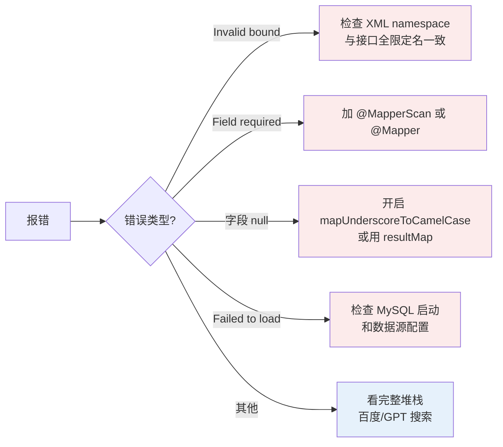

---

## 8. 术语速查表

| 术语              | 一句话解释                               |
|-------------------|------------------------------------------|
| ORM               | 对象-关系映射，自动翻译表 ↔ 类           |
| MyBatis           | 半自动 ORM 框架，SQL 仍手写              |
| MyBatis-Plus      | MyBatis 的增强封装，简化 CRUD            |
| Mapper            | 数据访问层接口，定义 CRUD 方法           |
| POJO / Entity     | 与表对应的 Java 类                       |
| resultType        | 自动映射（要求字段名 = 属性名）          |
| resultMap         | 手动映射（用于关联查询）                 |
| namespace         | XML 的命名空间，必须等于接口全限定名     |
| 动态 SQL          | `<if>` `<where>` `<foreach>` 等条件拼装  |
| `@TableName`      | MyBatis-Plus 注解，指定对应表名          |
| `@TableId`        | MyBatis-Plus 注解，指定主键及策略        |
| Maven             | Java 项目管理工具（依赖/编译/测试/打包） |
| Lombok            | 注解生成 getter/setter 的工具            |
| `@SpringBootTest` | 加载完整 Spring 容器跑测试               |

---

## 9. 自检清单（8 问）

| # | 问题                                               | 回看      |
|---|----------------------------------------------------|-----------|
| 1 | 我能说清 MyBatis 在三层架构里的位置吗？            | 2.1       |
| 2 | 我能区分 resultType 和 resultMap 的使用场景吗？    | 2.3       |
| 3 | 我能解释为什么 `@MapperScan` 是必需的？            | 1.3       |
| 5 | 我能写出 `map-underscore-to-camel-case` 配置项吗？ | 4.1       |
| 5 | 我能用 resultMap 写一个"订单 + 用户"的关联查询吗？ | 4.2       |
| 6 | 我能用 `<foreach>` 写批量删除并避免 `IN ()` 吗？   | 4.3       |
| 7 | 我能独立写出一个 POJO + Mapper + 测试用例吗？      | 3.4 / 3.5 |
| 8 | 我能排查 `Invalid bound statement` 错误吗？        | 7         |

> 8 题全 ✅ → 放心去做 P03 的业务层。
> 任意 ❌ → 回看对应章节。

---

## 10. 课后任务

| # | 任务                                       | 截止       | 提交                       |
|---|--------------------------------------------|------------|----------------------------|
| 1 | 完成实验报告（含 3 项成果截图 + 代码片段） | 下次上课前 | gitee `docs/P02-report.md` |
| 2 | 未通过测试的小组在开放机房时间补做         | 下次上课前 | 测试报告更新               |
| 3 | 预习业务逻辑层——阅读"抽象类与接口"教材章节 | 下次上课前 | 读完即可                   |

**实验报告模板**：

```markdown
# P02 数据访问层 · 实验报告

## 1. 实验目的
## 2. 实验步骤（按 3.1 四步简述）
## 3. 实验成果
- 项目骨架：[gitee 链接]
- POJO + Mapper：[链接]
- JUnit 测试：[截图，至少 5 个绿色]
## 4. 遇到的问题与解决（≥ 2 条，重点是字段映射和关联查询）
## 5. 心得体会（≥ 200 字）
```

---

## 附：本课配套代码

```
技术文档/resources/P02-bookshop-dao/
├── pom.xml                                # 完整 pom（含 MyBatis-Plus + Lombok）
├── src/main/resources/
│   ├── application.yml                    # 数据源 + mapUnderscoreToCamelCase
│   └── mapper/
│       ├── UserMapper.xml                 # 含关联查询 + 动态 SQL 范例
│       └── BookMapper.xml
├── src/main/java/com/example/bookshop/
│   ├── BookshopApplication.java           # @MapperScan 启动类
│   ├── entity/                            # User、Book、Order 等 POJO
│   └── mapper/                            # UserMapper、BookMapper 接口
└── src/test/java/com/example/bookshop/mapper/
    ├── UserMapperTest.java                # 5 个测试方法
    └── BookMapperTest.java
```

> 💡 请以本文档代码为准——教材示例可能用了不同 MyBatis 版本。